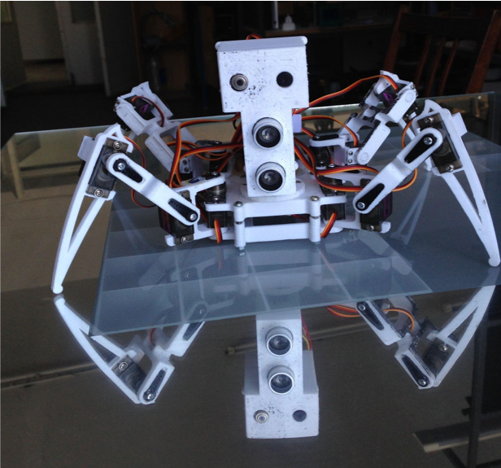

# Healthcare-Assistive Quadruped Robot

A low-cost, modular quadruped robot designed for autonomous and semi-autonomous assistive tasks in healthcare environments, such as elderly care and infectious disease monitoring. The robot features real-time video streaming, non-contact thermal sensing, and object tracking.

---

## 📑 Table of Contents

- [Overview](#overview)
- [Key Features](#key-features)
- [Hardware Design & Modifications](#hardware-design--modifications)
- [Bill of Materials (BOM)](#bill-of-materials-bom)
- [Software & Firmware](#software--firmware)
- [Repository Structure](#repository-structure)
- [Build & Installation](#build--installation)
- [Usage](#usage)
- [Research Paper](#research-paper)
- [Acknowledgements](#acknowledgements)
- [License](#license)

---

## Overview

This project involves the design and development of a fully functional assistive quadruped robot. The goal is to demonstrate that affordable, off-the-shelf components can be integrated into a robust platform capable of performing meaningful tasks in healthcare settings, thereby improving safety and quality of living.

The system supports multiple operational modes, including **Autonomous Follow Mode**, **Manual Control**, and **Remote Vital Monitoring**, all accessible through a custom server-side interface.

---

## Key Features

*   **Multi-Modal Operation:** Autonomous follow, manual control, and remote temperature scanning.
*   **Real-Time Vision:** ESP32-CAM module for live video streaming and object detection using TensorFlow Lite.
*   **Non-Contact Thermometry:** MLX90614 infrared sensor for safe, distant body temperature measurement.
*   **Modular & Custom PCB:** A custom-designed PCB integrates the ESP32, sensors, and servo control into a compact, reliable form factor.
*   **3D Printed Chassis:** A modular and easily reconfigurable body, allowing for rapid prototyping and modification.
*   **Web Interface:** A server-side dashboard to view video, control the robot, and monitor sensor data in real-time.

---

## Hardware Design & Modifications

**Important Attribution:** The initial design for the quadruped body (spider chassis and legs) is based on the excellent work from **[DIY Spider Robot/Quad-robot/Quadruped](https://www.instructables.com/DIY-Spider-RobotQuad-robot-Quadruped/)** on Instructables.

**Our significant modifications and enhancements include:**

1.  **Custom Robot Head:** A newly designed 3D-printed head assembly to house the ESP32-CAM and the MLX90614 thermal sensor.
2.  **Integrated Battery Holder:** A custom-designed battery compartment for secure and balanced power supply.
3.  **Custom Printed Circuit Board (PCB):** A PCB designed in KiCad that replaces the original breadboard/perfboard setup. This board cleanly integrates the ESP32, motor drivers, and all sensors, greatly improving reliability and reducing wiring complexity.
4.  **Advanced Sensor Suite:** The integration of the MLX90614 temperature sensor and ultrasonic distance sensors for environmental interaction, which were not part of the original design.

The electronics, firmware, and overall functional application of this robot are entirely original to this project.

---

## Bill of Materials (BOM)

*   **Microcontroller:** ESP32 / ESP32-CAM
*   **Actuation:** 12x MG90S Micro Servos
*   **Sensing:**
    *   MLX90614 Non-contact Infrared Temperature Sensor
    *   HC-SR04 Ultrasonic Distance Sensor
*   **Power:** 2S Li-Po Battery (7.4V)
*   **Structure:** 3D Printed Parts (see `./cad` directory)
*   **Custom Electronics:** PCB designed with KiCad (see `./pcb` directory)

---

## Software & Firmware

The firmware for the ESP32 is written in C++ (Arduino framework) and includes:
*   UART communication protocol for inter-device commands.
*   TensorFlow Lite for microcontrollers for on-device object detection.
*   WiFi and HTTP server for video streaming and data transmission.
*   PWM control for servo locomotion.

The server-side interface is built using the ESP32 CAM module, which connects to the server via Wi-Fi. Upon connection, it loads the TensorFlow Lite model for object detection and tracking. Visualization is handled using Node.js, which processes and displays real-time object tracking data, enabling seamless interaction between the ESP32 CAM module and the server.

---

## Build & Installation

1.  **Hardware Assembly:**
    *   Print the 3D models from the `./cad` directory.
    *   Solder all components onto the custom PCB according to the schematics in `./pcb`.
    *   Assemble the robot chassis, servos, and the custom head/battery holder.

2.  **Firmware Setup:**
    *   Open the `./firmware` project in the Arduino IDE or PlatformIO.
    *   Install the required libraries (`./firmware/arduino_esp32_dependencies`).
    *   Configure your WiFi credentials.
    *   Upload the code to your ESP32.

---

## Usage

1.  Power on the robot.
2.  The ESP32 will connect to your WiFi network.
3.  Access the web interface at the IP address assigned to the ESP32 (or via the server, depending on your setup).
4.  From the interface, you can:
    *   View the live video stream.
    *   Switch between Autonomous, Manual, and Temperature Scan modes.
    *   Control the robot's movement (in manual mode).
    *   See live data from the temperature and distance sensors.

---

## Research Paper

A detailed research paper covering the design rationale, implementation challenges, and validation of this system is available.

*   **PDF:** [`docs/assistive_robot_IEEE_TechRxiv.pdf`](docs/assistive_robot_IEEE_TechRxiv.pdf)
*   **Preprint:** Also available on [TechRxiv](https://www.techrxiv.org/doi/full/10.36227/techrxiv.176127211.13892804/v1)

---

## Acknowledgements

- The initial 3D model for the quadruped chassis was adapted from [DIY Spider Robot/Quad-robot/Quadruped](https://www.instructables.com/DIY-Spider-RobotQuad-robot-Quadruped/) on Instructables. We thank the original creator for the open-source design.
- Thanks to the open-source communities behind Arduino, TensorFlow Lite, and KiCad.

---

## License

*   The software and custom hardware designs (PCB, modified 3D parts) in this repository are licensed under the MIT License- see the LICENSE file for details.
*   Please note that the original 3D design from Instructables is subject to its own license terms. Please refer to the original source for more information.
